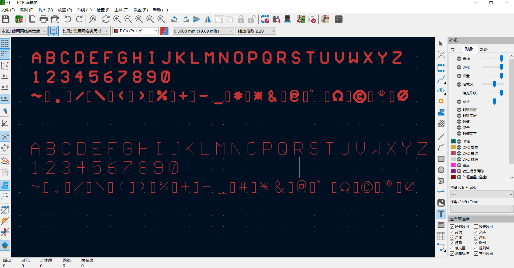

# PCBSansFont
A single line font based on physical PCB measurement and LITT1986 
# PCB Stroke Sans

一款基于实物PCB测量和LITT1986字体，专为PCB丝印、激光切割和工程文档设计。

## 📦 包含文件

| 文件 | 格式 | 用途 |
|------|------|------|
| `PCBStrokeSans-PCB-Regular.ttf` | TTF | PCB印制版（线宽150Em，用于丝印） |
| `PCBStrokeSans-Screen-Regular.ttf` | TTF | 屏幕显示版（线宽25Em，用于文档） |
| `PCBStrokeSans-Cut-Regular.shx` | SHX | 激光切割版（单线字体） |

## ✨ 字体特点

- **基于实物测量**：所有比例来自2023年PCB实物照片，结合LITT风格
- **工业折线感**：保留PCB矢量字体的直线拼接特征，所有折点均无贝塞尔曲线
- **三版本设计**：PCB版、屏幕版、切割版各司其职
- **工程验证**：已在KiCad，嘉立创和AutoCAD测试通过
- **SHX设计参数：大写高度 100 单位，下伸深度 25 单位。已包含正确的间距控制。

## 🔤 包含字符

- 26个大写字母（A-Z）
- 10个数字（0-9）
- 20个常用符号：~ . / \ ( ) % + -_ # *& @ ° Ω © ® φ ±
（SHX版本尚未制作®️，屏幕版和PCB印制板尚未制作±）

## 📄 许可证

本字体采用 [SIL Open Font License v1.1](LICENSE.txt)，可免费商用，但不可单独出售字体文件。

## 📮 问题反馈

如有问题，请提交 [Issue](https://github.com/zizuang/PCBSans/issues)或Email：zizuang@163.com

PCB Stroke Sans
https://preview.png

A font based on real-world PCB measurements and the LITT1986 style, designed for PCB silkscreen, laser cutting, and engineering documentation.

📦 Included Files
File	Format	Usage
PCBStrokeSans-PCB-Regular.ttf	TTF	PCB version (stroke width 150 Em, for silkscreen)
PCBStrokeSans-Screen-Regular.ttf	TTF	Screen display version (stroke width 25 Em, for documents)
PCBStrokeSans-Cut-Regular.shx	SHX	Laser cutting version (single‑line font)
✨ Font Features
Real‑world measurements: All proportions derived from 2023 PCB photos, combined with the LITT aesthetic.

Industrial polyline feel: Retains the straight‑line construction of PCB vector fonts – no Bézier curves at any vertex.

Three versions: PCB, screen, and cutting editions each serve their purpose.

Engineering validation: Tested in KiCad, JLCPCB, and AutoCAD.

SHX design parameters: Cap height = 100 units, descender depth = 25 units. Correct spacing control is included.

🔤 Character Set
26 uppercase letters (A‑Z)

10 digits (0‑9)

20 common symbols: ~ . / \ ( ) % + - _ # * & @ ° Ω © ® φ ±
(The SHX version does not yet include ®; the screen and PCB versions do not yet include ±.)

📄 License
This font is licensed under the SIL Open Font License v1.1. It may be used freely for commercial purposes, but the font files may not be sold alone.

📮 Feedback
For issues, please submit an Issue or email: zizuang@163.com

 
